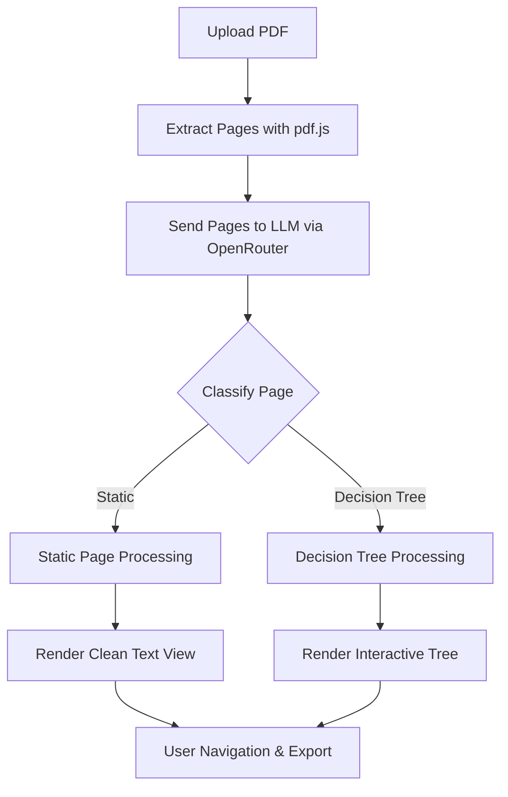

# 📑 PDF Analyzer & Decision Tree Explorer

A browser-based tool that processes PDF documents, classifies each page as **static content** or **decision tree content**, and provides interactive exploration with navigation, visualization, and export options.  

---

## 🚀 Features

- **PDF Upload & Processing** – Drag & drop or browse a PDF to analyze.  
- **Content Classification** – Pages are automatically tagged as:  
  - 📄 **Static Content** – regular text, headings, and tables.  
  - 🌳 **Decision Tree Content** – flowcharts, checklists, or branching logic.  
- **Interactive Navigation** – Jump to any page or explore sequentially.  
- **Decision Tree Viewer** – Expand/collapse branches and follow paths interactively.  
- **Static Page Viewer** – Render page content with overlapping elements fixed.  
- **Export Options** – Save results as **JSON** or **HTML**.  
- **Batch Processing** – Efficient concurrent classification for large PDFs.  
- **User Controls** – Restart analysis, expand/collapse trees, step tracking.  

---

## ⚡ How It Works
The process Flow


1. **Upload PDF** → App extracts page images using **pdf.js**.  
2. **Page Classification** → Each page is analyzed with an LLM (via **OpenRouter API**).  
3. **Routing**:  
   - Static content → cleaned, displayed as text.  
   - Decision tree → transformed into interactive branching logic.  
4. **Visualization** → Explore via navigation bar, expand/collapse trees.  
5. **Export** → Results can be downloaded as JSON or HTML.  

---

## 🛠️ Setup & Usage

### 1. Clone the repository
```bash
git clone https://github.com/Nitin399-maker/playbook.git
cd playbook

